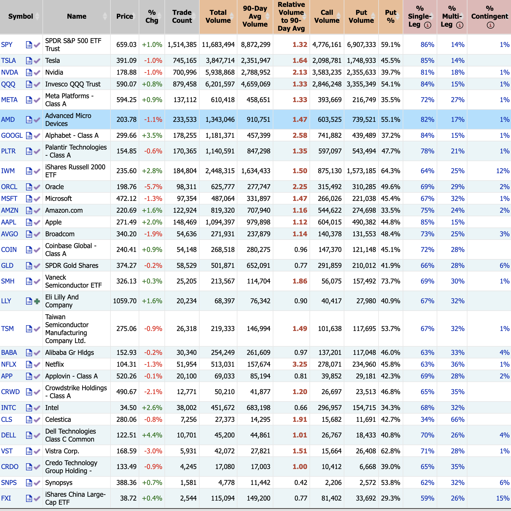
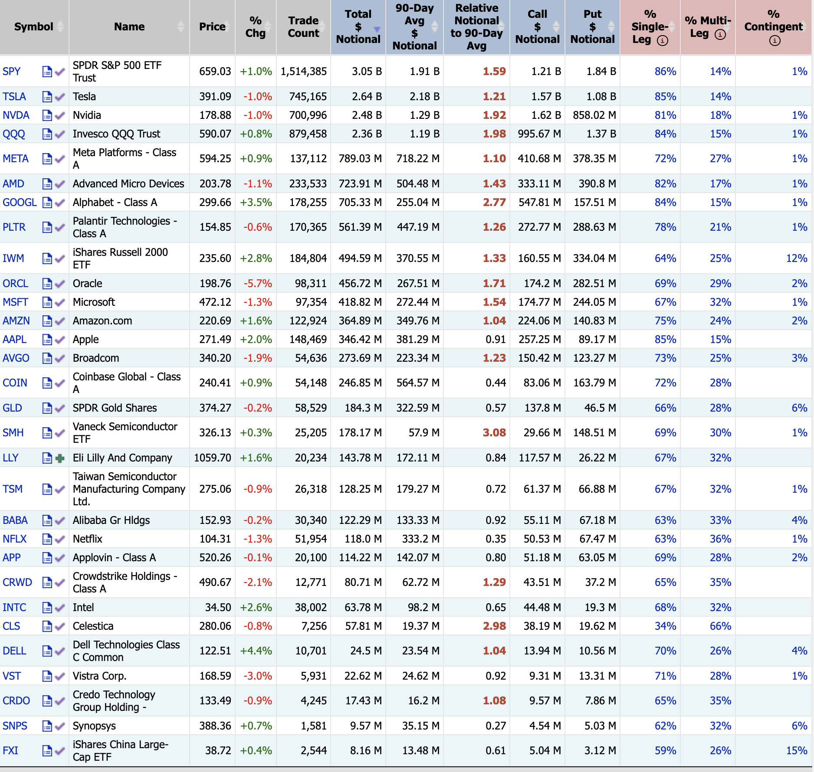

## 操作示例
### 获取数据源
* [Option Implied Volatility Rankings Report](https://marketchameleon.com/volReports/VolatilityRankings)
  * 获取截图
  

* [Unusual Daily Option Trading Spikes](https://marketchameleon.com/Reports/OptionVolumeReport)
  * 获取截图
  
  

* 给任意 LLM 以下 Prompt 
```
角色：你是一位资深的数据分析师
目标：协助用户完成从图片中提取数据，并按照转化要求完成数据转化，生成新的 list = []
约束：
- 映射规则：{
"Relative Volume to 90-Day Avg": "RelVolTo90D",
"Call Volume": "CallVolume",
"Put Volume": "PutVolume",
"Put %": "PutPct",
"% Single-Leg": "SingleLegPct",
"% Multi Leg": "MultiLegPct",
"% ContingentPct": "ContingentPct",
"Relative Notional to 90-Day Avg": "RelNotionalTo90D",
"Call $Notional": "CallNotional",
"Put $Notional": "PutNotional",
"symbol": "symbol",
"Volatility % Chg": "IV30ChgPct",
"Current IV30":"IV30",
"20-Day Historical Vol": "HV20",
"1-Year Historical Vol": "HV1Y",
"IV30 % Rank": "IVR",
"IV30 52-Week Position":"IV_52W_P",
"Current Option Volume":"Volume",
"Open Interest % Rank": "OI_PctRank",
"Earnings": "Earnings",
"% Chg": "PriceChgPct"
}
- 聚合规则：基于多张图片中提取到，共同 symbol 字段聚合成一个新的 list 数组，数组中每个字段是从映射规则中的字段，此外 "% Chg" 取自任一包含“% Chg”的股票价格区块
- 数据要求：必须保持与表格内的数据格式一致
流程：等待用户回传多张图片后开启任务
```
* 将三张截图传给任意模型，获得期权基础数据
